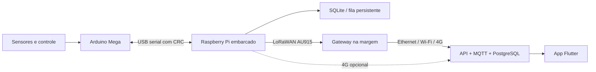

# Telemetria Minerva

Plataforma de telemetria para os modelos navais da Minerva Nautica, com cobertura planejada para um lago de ate 2 km, processamento embarcado em Raspberry Pi e acesso por aplicativo para equipe e laboratorio.

## Escopo

- coleta no Arduino Mega dos sensores e estados do controle azimutal;
- processamento, armazenamento e reenvio no Raspberry Pi embarcado;
- gravacao de trajetorias e piloto automatico por waypoints, liberado somente pela chave fisica do radio;
- enlace LoRa/LoRaWAN em 915-928 MHz entre barco e margem;
- gateway de margem com internet por Ethernet, Wi-Fi ou 4G;
- backend com autenticacao, historico, alertas e tempo real;
- aplicativo Flutter para Android, iOS e Web;
- operacao degradada quando a internet ou o radio falhar.

> O piloto automatico e experimental e nunca substitui o controle RC, o fail-safe nem a parada de emergencia. O Arduino so aceita comandos da Raspberry quando o canal CH3 esta fisicamente em AUTO; ao voltar para MANUAL, o comando remoto e cancelado imediatamente.

## Arquitetura



Mais detalhes: [arquitetura](docs/arquitetura.md), [autonomia e rotas](docs/autonomia.md), [hardware](docs/hardware.md), [BOM](docs/bom.md), [operacao](docs/operacao.md) e [teste de campo](docs/teste-campo.md).

## Sensores identificados nos esquemas

| Medida | Componente atual | Observacao |
| --- | --- | --- |
| Posicao | GPS NEO-6M | UART; considerar M8N/M10 para maior robustez |
| Aceleracao/inclinacao | ADXL345 | I2C; nao fornece rumo absoluto |
| Temperatura | LM35 | Analogico |
| Corrente | ACS712 | Analogico; requer calibracao de zero e filtragem |
| Tensao da bateria | Modulo 0-25 V | Analogico; requer calibracao |
| Umidade/temperatura interna | DHT11 | Trocar por SHT31/BME280 e adicionar sensor de agua |
| Estado do propulsor | Firmware azimutal | Angulo, aceleracao, PWM e fail-safe |

## Estrutura prevista

```text
firmware/mega/       aquisicao e enquadramento no Arduino
edge/boat/           servico do Raspberry Pi embarcado
edge/gateway/        servico do gateway de margem
backend/             API, ingestao MQTT, alertas e banco
app/                 aplicativo Flutter
protocol/            contratos de mensagens e versoes
deploy/              Docker Compose e servicos systemd
docs/                arquitetura, montagem e testes
```

## Fases

1. Reproduzir sensores em bancada e calibrar cada canal.
2. Implementar pacote serial versionado com CRC e simulador.
3. Gravar e visualizar dados localmente no Raspberry Pi.
4. Validar LoRa a 100 m, 500 m, 1 km e 2 km.
5. Subir backend e aplicativo com dados simulados.
6. Integrar um barco e executar teste de perda de enlace.
7. Escalar para os demais barcos e habilitar alertas.

## Projeto relacionado

- [mari-2215/azimutal-minerva](https://github.com/mari-2215/azimutal-minerva)

## Licenca

MIT.

## Estado atual

- protocolo USB serial com CRC-16 e recuperacao apos ruido;
- fila SQLite independente para nuvem e LoRaWAN;
- payload LoRaWAN binario de 37 bytes;
- driver RAK3172/RUI3 com OTAA e AU915;
- API FastAPI com ingestao, historico, WebSocket, papeis e alertas;
- integracao HTTP ChirpStack;
- app Flutter com login, frota, alarmes, mapa e painel ao vivo;
- app com planejamento de rota, coordenadas/temperatura no mapa e modelo 3D de atitude ligado ao ADXL345;
- firmware integrado para Arduino Mega com dois servos, ESC, modos MANUAL/RECORD/AUTO e watchdog;
- missoes persistentes no backend e na Raspberry, com controlador fuzzy de rumo e distancia;
- Docker, systemd e CI para Python, firmware, Flutter e container.

## Aplicativos Android e iPhone

O GitHub Actions gera automaticamente um APK Android instalavel, um AAB para a Google Play e uma compilacao iOS sem assinatura. Os pacotes ficam disponiveis na secao **Artifacts** de cada execucao do workflow `CI`.

A distribuicao para iPhone exige assinatura Apple. O caminho recomendado para a equipe e o laboratorio e o TestFlight. Consulte [docs/aplicativos.md](docs/aplicativos.md) para baixar o APK e preparar a conta Apple.

## Modelo 3D

O painel de atitude usa uma versão GLB do [MİNİ 10 TUGBOAT](https://grabcad.com/library/mini-10-tugboat-1), de Altug Tuncel / Berkeley Engineering. O modelo foi convertido para uso acadêmico e não comercial no aplicativo. Veja os detalhes em [docs/ATRIBUICOES.md](docs/ATRIBUICOES.md).
